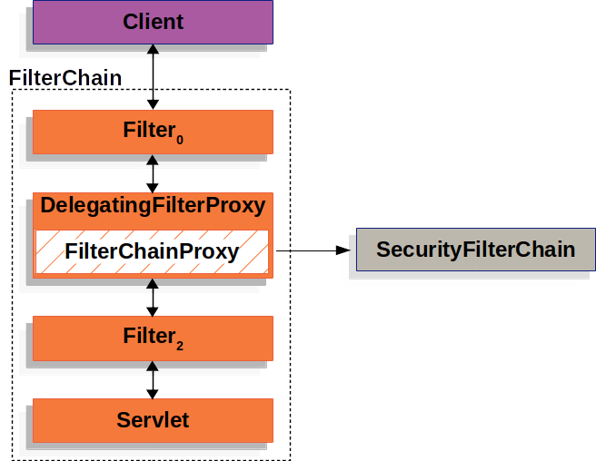

# Architecture

>[! note] https://docs.spring.io/spring-security/reference/servlet/architecture.html 공식 문서를 번역하며 참고 어색한 표현이 있을 수 있음.

* 이 섹션에서는 서블릿 기반의 애플리케이션에서의 Spring Security의 고수준 아키텍처에 대해서 다룬다.

## Review of Filters

Spring Security의 서블릿 기능은 ***서블릿 필터***에 기반한다. 그렇기 때문에 필터의 일반적인 역할에 대해서 먼저 확인해보는 것이 도움이 된다. 아래 이미지는 한번의 HTTP 요청에 대한 일반적인 필터 계층을 보여준다.


클라이언트는 애플리케이션에 요청을 보내고, 컨테이너는 요청 URI에 기반하여 Filter 인스턴스들과 `HttpServletRequest` 프로세스를 담당할 서블릿을 포함하는 FilterChain을 생성한다. Spring MVC 애플리케이션에서는 서블릿은 `DispatcherServlet` 의 인스턴스이다. 하나의 서블릿은 오직 하나의 `HttpServletRequest` 와 `HttpServletResponse` 를 다룰 수 있다. 하지만 하나이상의 Filter는 아래와 같이 사용될 수 있다.
* 하위 우선순의의 Filter 나 Servlet이 호출되지 않도록 방지한다. 이 경우 Filter 는 `HttpServletResponse` 를 return 한다.
* 하위 우선순위 Filter 나 Servlet에 의해 사용되는  `HttpServletRequest` 나 `HttpServletResponse` 를 조작한다.
Filter 의 강점은 FilterChain에서 나온다.

***FilterChain*** 사용 예제
``` java
public void doFilter(ServletRequest request, ServletResponse response, FilterChain chain) { 
	// do something before the rest of the application chain.
	doFilter(request, response); // invoke the rest of the application 
	// do something after the rest of the application 
}
```
Filter 는 하위 Filter 나 Servlet 에 영향을 미치기 때문에, 각 Filter 간의 우선순위는 매우 중요하다.

## DelegatingFilterProxy

스프링은 DelegatingFilterProxy라는 이름의 Filter 구현체를 제공한다. DelegatingFilterProxy 는 Servlet 컨테이너의 라이프사이클과 스프링 ApplicationContext 간의 연결을 가능하게 한다. 서블릿 컨테이너는 자체 표준을 사용하여 Filter 인스턴스를 등록할 수 있지만, 스프링에서 정의된 빈(Beans) 은 인식하지 못한다. 우리는 
DelegatingFilterProxy 등록하여 활용할 수 있다. DelegatingFilterProxy는 서블릿 컨테이너 메커니즘을 통해 등록할 수 있으며, 모든 작업을 Filter 를 구현한 Spring Bean 에 위임한다.
아래 그림은 DelegatingFilterProxy 가 Filter 인스턴스와 FilterChain에 적용되는 방식을 보여준다.


DelegatingFilterProxy 는 스프링 ApplicationContext 로부터 Bean Filter0 을 찾고 Bean Filter0을 호출한다. 아래 코드는 DelegatingFilterProxy 의 슈도 코드이다. 

```java
public void doFilter(ServletRequest request, ServletResponse response, FilterChain chain) {
	Filter delegate = getFilterBean(someBeanName);
	delegate.doFilter(request, response);
}
```
1. 스프링 Bean 으로 등록된 Filter 를 lazy 하게 가져온다. 위 예제에서 delegate 변수는 Bean Filter0의 인스턴스이다. 
2. Delegate 는 Spring Bean으로 동작한다. 

## FilterChainProxy

스프링 시큐리티의 서블릿 지원은 FilterChainProxy에 포함되어 있다. FilterChainProxy 는 스프링에서 제공하는 특수한 Filter 로, SecurityFilterChain 을 통해 여러 필터 인스턴스에 위임할 수 있게 한다. FilterChainProxy 가 스프링 Bean 이기 때문에, DelegatingFilterProxy에 래핑되어 있다. 
아래 그림은 FilterChainProxy의 역할 을 보여준다.



## SecurityFilterChain

FilterChainProxy에 의해 사용되는 SecurityFilterChain은 현재 요청에 어떤 스프링 시큐리티 Filter 가 작동되어야 하는지를 결정한다.
아래 이미지는 SecurityFilterChain 의 역할을 보여준다.


`SecurityFilterChain` 내에 있는 Security Filter들은 일반 Bean 이지만 `DelegatingFilterProxy` 가 아닌 `FilterChainProxy` 를 통해 등록된다.  
`FilterChainProxy` 는 Security Filter들이 서블릿 컨테이너나 `DelegatingFilterProxy` 에 직접적으로 등록되는 것에 비해 몇가지 장점을 가진다. 

첫번째, 스프링 시큐리티의 서블릿 지원의 시작점을 제공한다. 그 덕분에 스프링 시큐리티의 서블릿 지원 기능을 디버깅하려면 `FilterChainProxy` 는 디버깅 포인트를 두면 된다.
둘째, `FilterChainProxy` 는 스프링 시큐리티의 중심적인 역할을 하기 때문에, 선택적인 작업이 아닌 필수적인 작업을 수행할 수 있다. 예를 들어, `SecurityContext` 를 메모리 누수로 부터 투명하게 할 수 있다. 또한 스프링 시큐리티의 `HttpFirewall` 을 적용하기 때문에 어플리케이션을 공격으로부터 보호할 수 있다. 
추가로, `SecurityFilterChain` 가 언제 적용되어야 하는지 결정하는 것에 유연성을 제공한다. 서블릿 컨테이너 내에서 Filter 인스턴스들은 URL 에만 의존하여 호출된다. 그러나 `FilterChainProxy` 는 `RequestMatcher` 인터페이스를 통해서 `HttpServletRequest` 내의 어떤 값이든 활용하여 호출 지점을 결정할 수 있다.

아래 이미지는 멀티 `SecurityFilterChain` 인스턴스를 보여준다.


멀티 `SecurityFilterChain` 상태에서, `FilterChainProxy` 는 어떤 `SecurityFilterChain` 이 사용되어야 하는지를 결정한다. URL 패턴이 매칭되는 오직 첫번째 `SecurityFilterChain` 이 호출된다. 만약 위 그림과 같이 `SecurityFilterChain` 이 설정되어 있는 상태에서 `/api/messages/` 로 요청이 들어온다면 `SecurityFilterChain(0)` 의 패턴 `/api/**` 과 매칭되기 때문에 `SecurityFilterChain(n)` 의 `/**` 패턴에도 매칭되지만 오직 `SecurityFilterChain(0)` 만 호출된다. 만약 URL이 `/messages/` 로 요청된다면, `SecurityFilterChain(0)` 의 패턴에는 매칭되지 않으므로 `FilterChainProxy` 는 계속해서 다른 `SecurityFilterChain` 들을 탐색한다. 다른 `SecurityFilterChain` 에 매칭되지 않았다고 가정하면 `SecurityFilterChain(n)` 이 호출된다. 

SecurityFilterChain(0) 은 오직 3개의 Filter 인스턴스를 설정되어 있지만, SecurityFilterChain(n) 은 4개의 시큐리티 Filter 인스턴스가 설정되어 있는 것을 확인할 수 있다. 각 SecurityFilterChain 은 고유하고 독립적으로 설정될 수 있는 점은 중요한 사항이다.  만약 어플리케이션이 특정 요청에 대해 스프링 시큐리티가 무시하도록 원한다면, SecurityFilterChain 은 시큐리티 Filter 를 하나도 갖지 않을 수 있다. 

## Security Filters

시큐리티 Filter 들은 `SecurityFilterChain API` 를 통해 `FilterChainProxy` 에 삽입된다. 각각의 Filter 들은 인증, 인가, 취약점 보호 등 각기 다른 목적으로 사용될 수 있다. Filter 들은 각각 정확한 시점에 호출되는 것을 보장하기 위해 특정 순서대로 실행된다. 예를 들어 인증 기능을 수행하는 Filter 는 인가 기능을 수행하는 Filter 보다 항상 먼저 호출되어야 한다. 일반적으로 스프링 시큐리티에서 제공하는 Filter 들의 순서를 알 필요는 없지만, 순서를 암으로써 얻는 이점들도 있을 수 있다. 만약 알고 싶다면 [`FilterOrderRegistration`](https://github.com/spring-projects/spring-security/tree/6.3.4/config/src/main/java/org/springframework/security/config/annotation/web/builders/FilterOrderRegistration.java) 을 참고하라.

위 내용에 대한 예시로 아래 보안 설정을 고려해볼 수 있다. 

```java
@Configuration
@EnableWebSecurity
public class SecurityConfig {

    @Bean
    public SecurityFilterChain filterChain(HttpSecurity http) throws Exception {
        http
            .csrf(Customizer.withDefaults())
            .authorizeHttpRequests(authorize -> authorize
                .anyRequest().authenticated()
            )
            .httpBasic(Customizer.withDefaults())
            .formLogin(Customizer.withDefaults());
        return http.build();
    }

}
```

위 설정은 아래와 같은 순서로 Filter를 설정하게 된다. 

1. `CsrfFilter` (HttpSecurity#csrf 에 의해 추가됨)
2. `UsernamePasswordAuthenticationFilter` (HttpSecurity#formLogin 에 의해 추가됨)
3. `BasicAuthenticationFilter` (HttpSecurity#httpBasic 에 의해 추가됨)
4. `AuthorizationFilter` (HttpSecurity#authorizeHttpRequests 에 의해 추가됨)

먼저, Csrf 공격을 방어하기 위해 Csrf Filter 가 호출된다. 
다음으로, 요청에 대한 인증을 수행하기 위해 인증 Filter 가 호출된다.
세번째로, 인가 기능을 수행하기 위해 Authorization Filter 가 수행 된다. 

### Printing Security Filters

>[! note]  위에 나열된 Filter 외의 Filter 가 있을 수 있다. 만약 필터 목록을 출력해보고자 하면 아래와 같인 방법으로 출력해볼 수 있다. 

우리가 추가한 Filter 가 시큐리티 Filter 에 추가되었는지 확실히 확인하기 위해서 호출되는 시큐리티 Filter 의 목록을 출력해보는 것은 유용할 수 있다. 

Filter 목록은 어플리케이션 구동 시점에 INFO 레벨로 로그에 출력된다. 아래와 같은 로그를 콘솔 로그에서 확인할 수 있다. 

``` text
2023-06-14T08:55:22.321-03:00  INFO 76975 --- [           main] o.s.s.web.DefaultSecurityFilterChain     : Will secure any request with [
org.springframework.security.web.session.DisableEncodeUrlFilter@404db674,
org.springframework.security.web.context.request.async.WebAsyncManagerIntegrationFilter@50f097b5,
org.springframework.security.web.context.SecurityContextHolderFilter@6fc6deb7,
org.springframework.security.web.header.HeaderWriterFilter@6f76c2cc,
org.springframework.security.web.csrf.CsrfFilter@c29fe36,
org.springframework.security.web.authentication.logout.LogoutFilter@ef60710,
org.springframework.security.web.authentication.UsernamePasswordAuthenticationFilter@7c2dfa2,
org.springframework.security.web.authentication.ui.DefaultLoginPageGeneratingFilter@4397a639,
org.springframework.security.web.authentication.ui.DefaultLogoutPageGeneratingFilter@7add838c,
org.springframework.security.web.authentication.www.BasicAuthenticationFilter@5cc9d3d0,
org.springframework.security.web.savedrequest.RequestCacheAwareFilter@7da39774,
org.springframework.security.web.servletapi.SecurityContextHolderAwareRequestFilter@32b0876c,
org.springframework.security.web.authentication.AnonymousAuthenticationFilter@3662bdff,
org.springframework.security.web.access.ExceptionTranslationFilter@77681ce4,
org.springframework.security.web.access.intercept.AuthorizationFilter@169268a7]

```

이렇게 하면 각 Filter Chain 에 구성된 보안 필터에 대해 확인할 수 있다. 

하지만 이게 다가 아니다. 우리는 우리 어플리케이션이 각 요청 마다 개별 필터의 호출을 출력하도록 구성할 수도 있다. 이는 우리가 추가한 필터가 특정 요청에 의해 호출되는 것을 눈으로 확인하고, 예외가 어디서 발생했는지 확인하는데에 도음이 된다. 그러기 위해서 어플리케이션이 우리는 보안 이벤트 [로그 설정](##Logging)을 할 수 있다.

### Filter Chain 에 커스텀 필터 추가하기

대부분 케이스에서 기본으로 제공되는 Security Filter 는 우리 어플리케이션에 보안 기능을 제공하기에 충분하다. 
우리가 tenant-id 라는 헤더 값을 가지고 현재 사용자가 해당 tenant-id 에 접근할 권한이 있는지 확인하는 필터를 추가하려고 한다고 가정해보자. 앞선 설명은 이미 우리에게 우리가 Filter 를 어디에 추가해야 하는지 단서를 제공한다. 우리는 현재 사용자가 누구인지 확인해야 하기 때문에, 우리는 인증 Filter 다음에 추가해야 한다. 

먼저, Filter 를 생성하자. 

``` java
import java.io.IOException;

import jakarta.servlet.Filter;
import jakarta.servlet.FilterChain;
import jakarta.servlet.ServletException;
import jakarta.servlet.ServletRequest;
import jakarta.servlet.ServletResponse;
import jakarta.servlet.http.HttpServletRequest;
import jakarta.servlet.http.HttpServletResponse;

import org.springframework.security.access.AccessDeniedException;

public class TenantFilter implements Filter {

    @Override
    public void doFilter(ServletRequest servletRequest, ServletResponse servletResponse, FilterChain filterChain) throws IOException, ServletException {
        HttpServletRequest request = (HttpServletRequest) servletRequest;
        HttpServletResponse response = (HttpServletResponse) servletResponse;

        String tenantId = request.getHeader("X-Tenant-Id"); (1)
        boolean hasAccess = isUserAllowed(tenantId); (2)
        if (hasAccess) {
            filterChain.doFilter(request, response); (3)
            return;
        }
        throw new AccessDeniedException("Access denied"); (4)
    }

}
```

위 샘플 코드는 아래와 같이 구성되어 있다.
1) 요청 헤더에서 tenant id 값을 가져온다.
2) 현재 유저가 해당 tenant id 에 접근할 수 잇는지 확인한다.
3) 만약 사용자가 권한이 있다면, 나머지 Filter Chain 을 수행한다.
4) 만약 사용자가 권한이 없다면, `AccessDeniedException` 을 발생시킨다.
>[! note] Filter Interface 를 구현하기보다, 우리는 Filter의 기본이 되는 클래스이면서, 요청마다 한번씩만 수행되고 HttpServletRequest 및 HttpServletResponse 와 함께  doFilterInternal() 메서드를 제공하는 [OncePerRequestFilter](https://docs.spring.io/spring-framework/docs/6.1.14/javadoc-api/org/springframework/web/filter/OncePerRequestFilter.html) 를 상속할 수 있다.

이제, 우리는 위 필터를 Security Filter Chain 에 추가해줘야 한다. 

``` java
@Bean
SecurityFilterChain filterChain(HttpSecurity http) throws Exception {
    http
        // ...
        .addFilterBefore(new TenantFilter(), AuthorizationFilter.class);
    return http.build();
}
```

`addFilterBefore` 체이닝 메서드를 사용해서 TenantFilter 를 `AuthorizationFilter` 앞에 추가할 수 있다. 

인가 필터 (AuthorizationFilter) 앞에 Filter 를 추가함으로써, 우리는 TenantFilter 가 인증 필터 (AuthenticationFilter) 다음에 호출될 것임을 확신할 수 있다. 우리는 또한 `addFilterAfter` 체이닝 메서드를 사용해서 특정 필터 다음에 추가할 수도 있고 또는 `addFilterAt` 체이닝 메서드를 사용해서 필터를 FilterChain의  특정 위치에 추가할 수도 있다.

그걸로 끝이다. 이제 TenantFilter 는 `FilterChain` 내에서 호출될 것이고 현재 사용자가 특정 tenant id 에 접근할 권한이 있는지 체크할 것이다. 

어떤 필터를 `@Component` 어노테이션을 사용하거나, Configuration 클래스에서 Bean으로 선언하는 등  Spring Bean 으로 선언할 때 주의해야 한다. 스프링 부트는 자동으로 그 필터를 embedded 컨테이너 (ex 톰캣)에 등록하기 때문이다. 그는 서블릿 컨테이너에 의해서 한번, Spring Security 를 통해서 한번 총 두번 각기 다른 순서로 호출되게 될 수도 있다. 

만약 스프링에서 제공하는 의존성 주입을 활용하기 위해서 Filter 를 Spring Bean 으로 등록하려면, 중복 호출을 방지하기 위해서 FilterRegistrationBean 으로 선언하고 enabled 속성을 false 로 설정함으로써, 스프링부트로 하여금 서블릿 컨테이너에 등록하지 않도록 설정할 수 있다.

``` java
@Bean
public FilterRegistrationBean<TenantFilter> tenantFilterRegistration(TenantFilter filter) {
    FilterRegistrationBean<TenantFilter> registration = new FilterRegistrationBean<>(filter);
    registration.setEnabled(false);
    return registration;
}
```

## Handling Security Exceptions

[`ExceptionTranslationFilter`](https://docs.spring.io/spring-security/site/docs/6.3.4/api/org/springframework/security/web/access/ExceptionTranslationFilter.html) 는 [`AccessDeniedException`](https://docs.spring.io/spring-security/site/docs/6.3.4/api/org/springframework/security/access/AccessDeniedException.html) 와 [`AuthenticationException`](https://docs.spring.io/spring-security/site/docs/6.3.4/api//org/springframework/security/core/AuthenticationException.html) 를 HTTP 응답으로 변환할 수 있도록 돕는다. 

`ExceptionTranslationFilter` 는 Security Filter 의 한 종류로써 `FilterChainProxy`에 추가된다. 

아래 이미지는 `ExceptionTranslationFilter` 와 다른 컴포넌트간의 관계를 보여준다.


1) 먼저, `ExceptionTranslationFilter` 는 어플리케이션의 나머지 부분을 호출하기 위해서  `FilterChain.doFilter(request, response)` 를 호출한다. 
2) 만약 사용자가 인증되지 않았거나, `AuthenticationException` 이 발생했다면 인증을 시작한다. 
	1) [SecurityContextHolder](https://docs.spring.io/spring-security/reference/servlet/authentication/architecture.html#servlet-authentication-securitycontextholder) 가 클리어 된다. 
	2) `HttpServletRequest` 는 인증이 성공적으로 완료된 후 원래 요청을 다시 처리할 수 있도록 [저장](## Saving Requests Between Authentication)된다.
	3) `AuthenticationEntryPoint` 는 client 로부터 인증을 요청하기 위해 사용된다. 로그인 페이지로 redirect 하거나 `WWW-Authenticate` 헤더를 보내게 된다. 
3) 그 외에, `AccessDeniedException` 이 발생하면 접근을 제한하기 위해 `AccessDeniedHandler` 가 호출된다. 
>[!note] 어플리케이션에서 AccessDeniedException 이나 AuthenticationException 를 throw 하지 않으면, ExceptionTranslationFilter 는 아무 동작도 하지 않는다.

`ExceptionTranslationFilter` 의 수도 코드는 아래와 같다. 

```java
try {
	filterChain.doFilter(request, response); (1)
} catch (AccessDeniedException | AuthenticationException ex) {
	if (!authenticated || ex instanceof AuthenticationException) {
		startAuthentication(); (2)
	} else {
		accessDenied(); (3)
	}
}
```

1) [Review of Filters](## Review of Filters) 에 서술한 바와 같이, `FilterChain.doFilter(request, response)` 를 호출하는 것은 나머지 어플리케이션의 로직을 호출하는 것과 동일하다. 이것은 만약 어플리케이션의 다른 부분 (`FilterSecurityInterceptor` 나 다른 security 메서드 등) 에서 `AuthenticationException` 나 `AccessDeniedException` 를 throw 하면 위 로직에서 캐치하고 핸들링할 수 있다는 것을 의미한다. 
2) 만약 사용자가 인증되지 않았거나, `AuthenticationException` 이 발생하면 인증 로직을 수행한다.
3) 그 외에는 접근을 제한한다.

## Saving Requests Between Authentication

[Handling Security Exceptions](## Handling Security Exceptions) 에 표현된 바와 같이, 요청이 인증되지 않았거나 인증이 필요한 자원에 대한 접근 요청이라면, 인증이 성공적으로 이루어진 후에 다시 인증된 자원에 재요청하기 위해서  request 정보를 저장할 필요가 있다. 스프링 시큐리티에서는 `HttpServletRequest` 를 저장하기 위해 [`RequestCache`](### RequestCache) 를 구현하여 처리한다. 

### RequestCache
`HttpServletRequest` 는 `RequestCache` 에 저장된다. 사용자 인증이 정상적으로 완료될 때, `RequestCache` 는 원래 요청을 다시 수행하기 위해 사용된다. [RequestCacheAwareFilter](### RequestCacheAwareFilter) 는 사용자 인증 후에 저장된 HttpServletRequest 를 가져오기 위해 RequestCache 를 사용한다. `ExceptionTranslationFilter`는 `AuthenticationException`을 감지한 후, 사용자를 로그인 엔드포인트로 리디렉션하기 전에 `RequestCache`를 사용하여 `HttpServletRequest`를 저장한다.

기본적으로, `HttpSessionRequestCache` 가 사용된다. 아래 코드는 `continue`라는 파라미터가 존재할 때  저장된 request 를 위한 HttpSession을 체크하는데 사용되는 RequestCache 구현체를 어떻게 커스터마이징 하는지 확인할 수 있다.

*RequestCache는 `continue` 파라미터가 존재할 때만 저장된 Request 를 확인한다.*
``` java
@Bean
DefaultSecurityFilterChain springSecurity(HttpSecurity http) throws Exception {
	HttpSessionRequestCache requestCache = new HttpSessionRequestCache();
	requestCache.setMatchingRequestParameterName("continue");
	http
		// ...
		.requestCache((cache) -> cache
			.requestCache(requestCache)
		);
	return http.build();
}
```

### Prevent the Request From Being Saved

사용자의 인증되지 않은 요청을 세션에 저장하기를 원치 않을 수도 있다. 또는 해당 작업을 사용자의 브라우저에 저장하거나, DB에 저장하기를 원할 수 있다. 또는 로그인 전에 사용자가 방문하려고 했던 페이지 대신 항상 홈 페이지로 리디렉션하려는 경우 이 기능을 비활성화할 수도 있다.

위 사항을 구현하기 위해, 아래와 같이 [the `NullRequestCache` implementation](https://docs.spring.io/spring-security/site/docs/6.3.4/api/org/springframework/security/web/savedrequest/NullRequestCache.html) 를 사용할 수 있다.

```java
@Bean
SecurityFilterChain springSecurity(HttpSecurity http) throws Exception {
    RequestCache nullRequestCache = new NullRequestCache();
    http
        // ...
        .requestCache((cache) -> cache
            .requestCache(nullRequestCache)
        );
    return http.build();
}
```

### RequestCacheAwareFilter

`RequestCacheArareFilter` 는 원래 요청을 재진행 하기 위해 `RequestCache` 를 사용한다.

## Logging

스프링 시큐리티는 보안과 관련된 모든 이벤트에 대한 종합적인 로깅을 DEBUG 와 TRACE 레벨로 제공한다. 이는 우리의 어플리케이션을 디버깅하는데에 매우 유용하다. 보안적인 이유로 스프링 시큐리티는 요청이 거절된 이유에 대한 세부 정보를 응답에 포함하지 않기 때문에, 401 또는 403 오류가 발생하면 무엇이 문제인지 이해하기 위한 정보를 로그에서 찾을 수 있다.

CSRF 방어가 활성화된 상태에서 사용자가 CSRF 토큰 없이 사용자가 POST 요청을 한다고 가정해보자. 로그가 없다면, 사용자는 왜 요청이 거절됐는지에 대한 설명 없이 403 에러만 받게 된다. 그러나 우리가 스프링 시큐리티의 로그를 활성화 해둔다면 우리는 아래와 같은 메시지를 확인할 수 있다.

```test
2023-06-14T09:44:25.797-03:00 DEBUG 76975 --- [nio-8080-exec-1] o.s.security.web.FilterChainProxy        : Securing POST /hello
2023-06-14T09:44:25.797-03:00 TRACE 76975 --- [nio-8080-exec-1] o.s.security.web.FilterChainProxy        : Invoking DisableEncodeUrlFilter (1/15)
2023-06-14T09:44:25.798-03:00 TRACE 76975 --- [nio-8080-exec-1] o.s.security.web.FilterChainProxy        : Invoking WebAsyncManagerIntegrationFilter (2/15)
2023-06-14T09:44:25.800-03:00 TRACE 76975 --- [nio-8080-exec-1] o.s.security.web.FilterChainProxy        : Invoking SecurityContextHolderFilter (3/15)
2023-06-14T09:44:25.801-03:00 TRACE 76975 --- [nio-8080-exec-1] o.s.security.web.FilterChainProxy        : Invoking HeaderWriterFilter (4/15)
2023-06-14T09:44:25.802-03:00 TRACE 76975 --- [nio-8080-exec-1] o.s.security.web.FilterChainProxy        : Invoking CsrfFilter (5/15)
2023-06-14T09:44:25.814-03:00 DEBUG 76975 --- [nio-8080-exec-1] o.s.security.web.csrf.CsrfFilter         : Invalid CSRF token found for http://localhost:8080/hello
2023-06-14T09:44:25.814-03:00 DEBUG 76975 --- [nio-8080-exec-1] o.s.s.w.access.AccessDeniedHandlerImpl   : Responding with 403 status code
2023-06-14T09:44:25.814-03:00 TRACE 76975 --- [nio-8080-exec-1] o.s.s.w.header.writers.HstsHeaderWriter  : Not injecting HSTS header since it did not match request to [Is Secure]
```

CSRF 토큰이 없기 때문에 요청이 거절됐다는 것을 확실하게 할 수 있다. 

우리 어플리케이션이 보안 이벤트에 대한 모든 로그를 출력하도록 설정하려면, 아래와 같은 설정을 하면 된다.

``` properties
# application.properties in Spring Boot
logging.level.org.springframework.security=TRACE
```
``` xml
<!-- logback.xml -->
<configuration>
    <appender name="STDOUT" class="ch.qos.logback.core.ConsoleAppender">
        <!-- ... -->
    </appender>
    <!-- ... -->
    <logger name="org.springframework.security" level="trace" additivity="false">
        <appender-ref ref="Console" />
    </logger>
</configuration>
```