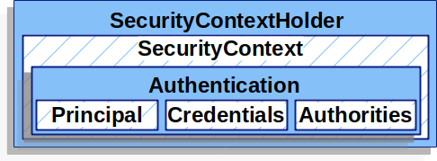
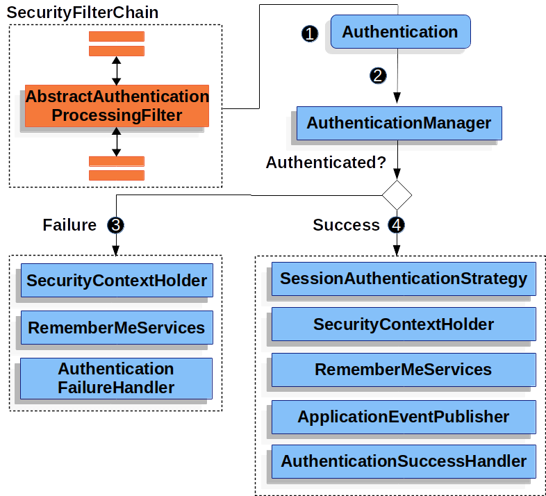

# Servlet Authentication Architecture

이 설명은 Servlet 인증에서 사용되는 스프링 시큐리티의 메인 컴포넌트들에 대한 추가 설명을 위한 [Architecture](obsidian://open?vault=obsinote&file=%EC%8A%A4%ED%84%B0%EB%94%94%2FSpring%2FSecurity%2F0.%20Intro#Architecture) 의 확장판이다. 만약 아래 항목들이 어떻게 작동하는지 구체적인 플로우가 궁금하다면 [Authentication Mechanism](obsidian://open?vault=obsinote&file=%EC%8A%A4%ED%84%B0%EB%94%94%2FSpring%2FSecurity%2F1.%20Authentication%2F0.%20Intro## Authentication Mechanisms) 섹션을 참고하라. 

* [SecurityContextHolder](## SecurityContextHolder) - `SecurityContextHolder` 는 스프링 시큐리티가 인증된 사용자에 대한 상세 정보를 저장하는 곳이다.
* [SecurityContext](## SecurityContext) - `SecurityContextHolder` 에서 얻을 수 있는 항목으로, 현재 인증된 사용자의 `Authentication` 정보를 갖고 있다.
* [Authentication](## Authentication) - `AuthenticationManager` 의 입력으로 제공될 수 있다. 이 객체는 사용자가 인증을 위해 제공한 자격 증명(credentials) 또는 `SecurityContext` 에서 현재 인증된 사용자 정보를 포함할 수 있다.
* [GrantedAuthority](## GrantedAuthority) - `Authentication` 내에서 사용자가 어떤 작업을 수행할 수 있는지를 결정하는 권한 정보를 포함하고 있다.
* [AuthenticationManager](## AuthenticationManager) - 스프링 시큐리티 Filter 들이 어떻게 인증 기능을 수행하는지에 대한 명세
* [ProviderManager] - `AuthenticationManager` 의 가장 일반적인 구현체
* [AuthenticationProvider] - 특정 유형의 인증 기능을 수행하기 위해서 `ProviderManager` 에 의해 사용된다. 
* [Request Credentials with AuthenticationEntryPoint] - client 로 부터 자격 증명을 요청하는데에 사용된다. (로그인 페이지로 리다이렉트 하거나, WWW-Authenticate 응답을 보내는 등)
* [AbstractAuthenticationProcessingFilter] - 인증을 위한 기본 Filter로, 인증을 수행하기 위해 각 모듈들이 어떻게 수행되는지 고수준의 플로우를 이해하는데 유용한 필터.

## SecurityContextHolder

스프링 시큐리티의 인증 모델의 중심에는 `SecurityContextHolder` 가 있다. `SecurityContextHolder` 는 `SecurityContext` 를 포함하고 있다.



`SecurityContextHolder`는 스프링 시큐리티가 누가 인증되었는지에 대한 정보를 저장하는 곳이다. 스프링 시큐리티는 `SecurityContextHolder` 가 어떻게 채워지는지 관여하지 않는다. 만약 값이 있다면 그 값은 현재 인증된 사용자의 정보로 사용된다. 

사용자가 인증됐음을 표현하는 가장 간단한 방법은 `SecurityContextHolder` 를 바로 설정하는 것이다.

```java
SecurityContext context = SecurityContextHolder.createEmptyContext(); (1)
Authentication authentication =
    new TestingAuthenticationToken("username", "password", "ROLE_USER"); (2)
context.setAuthentication(authentication);

SecurityContextHolder.setContext(context); (3)
```

1) 우리는 빈 `SecurityContext` 를 생성하는 것으로 시작한다. 멀티 쓰레드 환경에서 race condition 을 피하기 위해서 `SecurityContextHolder.getContext().setAuthentication(authentication)` 를 사용하기보다 새로운 `SecurityContext` 인스턴스를 만들어 사용해야 한다.
2) 다음, 우리는 새로운 `Authentication` 객체를 생성한다.  스프링 시큐리티는 어떤 유형의 `Authentication` 구현체가 `SecurityContext` 에 설정되었는지 관여하지 않는다. 여기서, 우리는 `TestingAuthenticationToken` 를 사용한다. 매우 간단하기 때문이다. 일반적으로는 `UsernamePasswordAuthenticationToken(userDetails, password, authorities)` 를 사용한다.
3) 마지막으로, `SecurityContextHolder` 에 `SecurityContext` 를 설정한다. 스프링 시큐리티는 이 정보를 인증에 활용한다.

인증된 내용에 대한 정보를 얻기 위해서는 `SecurityContextHolder`에 접근하라.

```java
// 현재 인증된 사용자 정보에 접근하는 방법
SecurityContext context = SecurityContextHolder.getContext();
Authentication authentication = context.getAuthentication();
String username = authentication.getName();
Object principal = authentication.getPrincipal();
Collection<? extends GrantedAuthority> authorities = authentication.getAuthorities();
```

기본적으로 `SecurityContextHolder` 는 이런 세부사항을 저장하는데에 `ThreadLocal` 을 사용한다. 이는 곧 `SecurityContext` 가 같은 스레드 내에서는 메서드들이 명시적으로 `SecurityContext` 를 인자로 전달하지 않아도 `SecurityContext` 에 접근할 수 있음을 의미한다. 이런 방식으로 `ThreadLocal` 을 사용하는 것은 꽤 안전하지만, 요청이 처리된 후에 스레드를 정리하는 작업을 적절하게 수행해야 안전하게 사용할 수 있다. 스프링 시큐리티의 [FilterChainProxy](obsidian://open?vault=obsinote&file=%EC%8A%A4%ED%84%B0%EB%94%94%2FSpring%2FSecurity%2F0.%20intro%2F0.%20Intro) 는 `SecurityContext` 가 항상 정리되는 것을 보장한다.

몇몇 어플리케이션은 어플리케이션마다 스레드를 통해 작동하는 특정 방식 때문에,  `ThreadLocal` 을 사용하기에 완전히 적합하지 않을 수 있다. 예를 들어, 스윙 클라이언트는 자바 가상 머신의 모든 스레드가 동일한 Security Context 를 사용하기를 원할 수 있다.  우리는 구동 시점에 `SecurityContextHolder` 전략을 활용하여 context 가 원하는 방식으로 저장 되도록 설정할 수 있다.  단일 어플리케이션의 경우 `SecurityContextHolder.MODE_GLOBAL` 전략을 사용할 수 있다. 어떤 어플리케이션은 보안 스레드에 의해 생성된 스레드도 동일한 보안 규칙을 가지기를 원할 수 있다.  그럴 경우 우리는 기본 모드인 `SecurityContextHolder.MODE_THREADLOCAL` 를 두가지 방식으로 변경할 수 있다. 첫번째는 system 프로퍼티로 설정하는 방법이다. 두번째는 `SecurityContextHolder` 의 정적 메소드를 호출하는 방법이다. 대부분의 어플리케이션은 기본 설정에서 변경할 필요가 없다. 그러나 변경해야 한다면 `SecurityContextHolder` 의 javaDoc 을 참조하라.

## SecurityContext

SecurityContext 는 SecurityContextHolder 에서 획득할 수 있다. SecurityContext 는 인증 객체를 포함하고 있다. 

## Authentication

`Authentication` 인터페이스는 스프링 시큐리티에서 두가지 목적으로 사용된다.

* 사용자가 인증을 위해 제공한 자격 증명(credentials)을  `AuthenticationManager` 에 제공하는 역할을 한다. 이 시나리오에서 `isAuthenticated()` 는 false 를 반환한다.
* 현재 인증된 사용자를 대변한다. 우리는 `SecurityContext` 에서 현재 인증 정보를 획득할 수 있다.

`Authentication` 은 아래 사항을 포함한다.

* `principal` : 사용자를 식별한다. username/password 방식으로 인증을 진행하면 `UserDetails` 의 인스턴스가 된다. 
* `credentials` : 주로 비밀번호로 사용되고, 사용자 인증이 완료된 후에는 유출되지 않는 것을 확신하기 위해 삭제된다. 
* `authorities` : `GrantedAuthority` 인스턴스들은 사용자가에게 부여된 고급 권한이다. role 과 scope 의 예시가 있다.

## GrantedAuthority

`GrantedAuthority` 인스턴스들은 사용자가에게 부여된 고급 권한이다. role 과 scope 의 예시가 있다.

우리는 `Authentication.getAuthorities()` 메소드를 통해서 `GrantedAuthority`  를 획득할 수 있 다. 이 메소드는 우리에게 `GrantedAuthority` 객체 `Collection` 을 제공한다. `GrantedAuthority` 는 예상대로, 주체(principal)에 부여된 권한(authority) 이다. 권한은 보통 `ROLE_ADMINISTRATOR` 이나 `ROLE_HR_SUPERVISOR` 같은 '역할(roles)' 이다. 이러한 역할들은 나중에 웹 인가나 메소드 인가, 도메인 객체 인가에 대해 구성된다. 스프링 시큐리티의 다른 부분들은 이 권한(authorities)을 해석하고 존재하기를 기대한다. username/password 방식의 인증을 사용할 때 `GrantedAuthority` 는 보통 `UsersDetailsService` 에 의해 로딩된다.

## AuthenticationManager

`AuthenticationManager` 는 스프링 시큐리티의 필터들이 어떻게 인증을 수행하는지에 대한 명세(API) 이다. `Authentication` 객체는 `AuthenticationManager` 를 호출한 컨트롤러 (즉, 스프링 시큐리티의 필터 인스턴스) 에 의해 `SecurityContextHolder` 에 설정된다. 만약 스프링 시큐리티 필터와 연동하지 않는다면, 우리는 `SecurityContextHolder` 를 직접 설정하고 `AuthenticationManager` 를 강제로 사용하지 않아도 된다. 

## ProviderManager

`ProviderManager` 는 `AuthenticationManager` 의 가장 보편적으로 사용되는 구현체이다. `ProviderManager` 는 `AuthenticationProvider` 리스트에 위임하여 인증을 처리한다. 각 `AuthenticationProvider`는 인증이 성공해야 한다고 판단하면 인증을 완료하거나, 실패한다고 판단하면 실패를 반환할 수 있다. 만약 자신이 인증을 처리할 수 없다고 판단되면, 인증을 처리할 수 있는 다른 `AuthenticationProvider`가 결정을 내릴 수 있도록 인증을 위임할 수도 있다. 만약 인증을 수행할 수 있는 `AuthenticationProvider` 가 설정된게 없다면 인증은`ProviderNotFoundException` 에러와 함께 실패한다. `ProviderNotFoundException` 은 전달된 `Authencation` 유형을 지원하는 `ProviderManager` 가 설정되지 않았음을 나타내는 `AuthenticationException` 이다. 


예제에서 각 `AuthenticationProvider` 는 특정 유형의 인증을 수행해야 하는 방법을 알고 있다. 예를 들어 어떤 `AuthenticationProvider` 는 username / password 를 검증할 수 있고, 다른 `AuthenticationProvider` 는 SAML 검증을 수행할 수도 있다.  이는 각 `AuthenticationProvider` 가 매우 특정한 유형의 인증을 처리할 수 있게 해주며, 여러 종류의 인증을 지원하면서도 단일 `AuthenticationManager` Bean 으로 처리될 수 있도록 한다. 
`ProviderManager` 는 또한 선택적으로 부모 `AuthenticationManager` 설정을 가능하게 한다. 만약 어떤 `AuthenticationProvider` 도 인증을 수행할 수 없는 경우, 부모 `AuthenticationManager` 가 호출되어 인증을 처리할 수 있다. 부모 `AuthenticationManager` 는 어떤 유형이든 될 수 있지만 보통 `ProviderManager` 인스턴스가 사용된다.


사실 여러개의 `ProviderManager` 인스턴스들은 같은 부모 `AuthenticationManager` 를 공유한다. 이것은 여러 개의 `SecurityFilterChain` 인스턴스가 공통된 인증(`AuthenticationManager`)을 공유하지만 서로 다른 인증 메커니즘을 가지고 있는 경우(각각의 `ProviderManager` 인스턴스)에서 흔히 사용되는 방식이다. 


기본적으로 `ProviderManager` 는 성공적인 인증 요청으로부터 반환되는 `Authentication` 객체로부터 민감한 credential 정보를 삭제하기 위해 노력한다. 이는 비밀번호나 필요 이상으로 길게 생성된 `HttpSession` 과 같은 정보를 방지한다. 

이는 무상태 어플리케이션에서 성능 향상을 위해 사용자 객체의 캐시를 사용할 때 문제를 일으킬 수 있다. 만약 `Authentication` 이 캐시 내에 있는 객체의 참조 정보(`UserDetails` 인스턴스와 같은) 를 포함하고 있는 상태에서 credential 정보가 제거된다면 캐시된 값에 대해서는 더이상 인증이 불가능하다. 캐시를 사용하려면 이 점을 고려해야 한다. 명백한 해결 방법은  캐시 구현체 또는 반환된 `Authentication` 객체를 생성하는 `AuthenticationProvider`에서 객체의 복제본을 만드는 방법이다. 다른 방법으로는 `ProviderManager` 의 `eraseCredentialsAfterAuthentication` 속성을 비활성화 하는 방법도 있다.  [ProviderManager](https://docs.spring.io/spring-security/site/docs/6.3.4/api/org/springframework/security/authentication/ProviderManager.html) 클래스의 javaDoc 을 참조.

## AuthenticationProvider

우리는 여러개의 `AuthenticationProvider` 인스턴스를 `ProviderManager` 에 주입할 수 있다. 각 `AuthenticationProvider` 는 고유한 유형의 인증을 수행한다. 예를 들어 `DaoAuthenticationProvider` 는 username / password 방식의 인증을 지원하고 `JwtAuthenticationProvider` 는 JWT 토큰을 활용한 인증을 지원한다.

## Request Credentials with AuthentationEntryPoint

[`AuthenticationEntryPoint`](https://docs.spring.io/spring-security/site/docs/6.3.4/api/org/springframework/security/web/AuthenticationEntryPoint.html) 는 클라이언트로부터 자격 증명(credentials) 을 요청하는 HTTP 응답을 보내는데 사용된다. 

가끔 클라이언트는 사전 예방적으로 리소스를 요청하기 위해 username 이나 password 같은 자격 증명(credentials)을 포함한다. 이런 경우에, 스프링 시큐리티는 클라이언트로부터 자격 증명을 요청하는 HTTP 응답을 제공할 필요가 없다. 

어떤 경우는, 클라이언트는 접근 권한이 없는 자원에 대해 인증되지 않은 요청을 보낸다. 이 경우에는 `AuthenticationEntryPoint` 구현체가 client 로 부터 자격 증명을 요청하는데에 사용된다. `AuthenticationEntryPoint` 구현체는 로그인 페이지로 리다이렉트를 수행하거나, WWW-Authenticate 헤더를 응답하거나, 그 외 다른 액션을 취할 수 있다. 

## AbstractAuthenticationProcessingFilter

`AbstractAuthenticationProcessingFilter` 는 사용자의 자격 증명을 인증하기 위한 기본 필터로 사용된다. 자격 증명이 인증되기 전 까지 스프링 시큐리티는 보통 [`AuthenticationEntryPoint`](https://docs.spring.io/spring-security/reference/servlet/authentication/architecture.html#servlet-authentication-authenticationentrypoint) 를 통해서 인증을 요청한다. 

다음으로, `AbstractAuthenticationProcessingFilter`는 제출된 모든 인증 요청을 처리하여 인증할 수 있다.



1) 사용자가 그들의 자격 증명을 제출하면, `AbstractAuthenticationProcessingFilter` 는 `HttpServletRequest` 로부터 인증될 `Authentication` 을 생성한다. `Authentication` 객체의 유형은 `AbstractAuthenticationProcessingFilter` 의 서브 클래스에 의해 생성된다. 예를 들어, [`UsernamePasswordAuthenticationFilter`](https://docs.spring.io/spring-security/reference/servlet/authentication/passwords/form.html#servlet-authentication-usernamepasswordauthenticationfilter) 는 `HttpServletRequest` 를 통해 제출된 username 과 password 로 `UsernamePasswordAuthenticationToken` 을 생성한다.
2) 다음, `Authentication` 은 인증을 위해 `AuthenticationManager` 로 전달된다. 
3) 인증에 실패하면
	1) `SecurityContextHolder` 는 정리(삭제) 된다. 
	2) `RememberMeServices.loginFail` 가 실행된다. 만약 remember me 가 설정되어 있지 않다면 이 메서드는 아무 작업도 하지 않는 **no-op (no operation)** 상태로 동작한다.
	3) `AuthenticationFailureHandler` 가 호출된다. ([`AuthenticationFailureHandler`](https://docs.spring.io/spring-security/site/docs/6.3.4/api/org/springframework/security/web/authentication/AuthenticationFailureHandler.html) 인터페이스 참고)
4) 인증이 성공하면
	1) `SessionAuthenticationStrategy` 는 새로운 로그인을 감지한다. ([`SessionAuthenticationStrategy`](https://docs.spring.io/spring-security/site/docs/6.3.4/api/org/springframework/security/web/authentication/session/SessionAuthenticationStrategy.html) 인터페이스 참고)
	2) `Authentication` 객체가 SecuritryContextHolder 에 설정된다. 만약 이후 요청에 자동으로 `SecurityContext` 이 저장되기를 원한다면, `SecurityContextRepository#saveContext`를 명시적으로 호출해야 한다. ([`SecurityContextHolderFilter`](https://docs.spring.io/spring-security/site/docs/6.3.4/api/org/springframework/security/web/context/SecurityContextHolderFilter.html) class 참고)
	3) `RememberMeServices.loginSuccess` 가 실행된다. remember me 가 설정되지 않았다면, 이 메서드는 no-op 상태로 동작한다. ([`rememberme`](https://docs.spring.io/spring-security/site/docs/6.3.4/api/org/springframework/security/web/authentication/rememberme/package-frame.html) 패키지 참고)
	4) `ApplicationEventPublisher` 는 `InteractiveAuthenticationSuccessEvent` 이벤트를 발행한다.
	5) `AuthenticationSuccessHandler` 가 호출된다. ([`AuthenticationSuccessHandler`](https://docs.spring.io/spring-security/site/docs/6.3.4/api/org/springframework/security/web/authentication/AuthenticationSuccessHandler.html) 인터페이스 참고)
